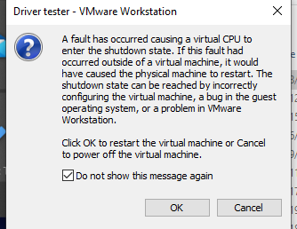

## Introduction

&emsp;&emsp;A while ago I wrote AetherVisor, a stealthy dynamic analysis and memory hacking framework, based on an AMD hypervisor. I no longer want to treat protected software as a black box, so I paused this project to study other topics such as x86 deobfuscation. AetherVisor is a minimal hypervisor, so it may be unstable, and many special instruction intercepts aren't supported. For more robust and stable tool development, it's better to use more established options like KVM. Although KVM has its advantages, AetherVisor remains a valuable tool for building minimal, stealthy, debugger tools and writing hacks.
<br>
<br> 

This is a general overview of AetherVisor's implementation, with insight into some potential issues.

<br> 

## Virtual machine setup

### Checking for AMD-V support 

Before any VM initialization, three conditions must be met:
<br> 
1. AMD SVM must be supported.
2. Virtualization must be enabled in BIOS, so that VM_CR.SVMDIS can be set to 0 and VM_CR.LOCK can be locked.
3. The MSR_EFER.svme bit is set, after conditions #1 and #2 are met.
<br> 
<br> 

*First, check if AMD SVM is supported*

<br> 
```cpp
enum CPUID
{    
    vendor_and_max_standard_fn_number = 0x0,
    feature_identifier = 0x80000001,
};

bool IsSvmSupported()
{
	int32_t	cpu_info[4] = { 0 };

	__cpuid(cpu_info, CPUID::feature_identifier);

    // 1. check if SVM is supported with CPUID Fn8000_0001_ECX

	if ((cpu_info[2] & (1 << 2)) == 0)
	{
		return false;
	}

	int32_t vendor_name_result[4];

	char vendor_name[13];

	__cpuid(vendor_name_result, CPUID::vendor_and_max_standard_fn_number);
	memcpy(vendor_name, &vendor_name_result[1], sizeof(int));
	memcpy(vendor_name + 4, &vendor_name_result[3], sizeof(int));
	memcpy(vendor_name + 8, &vendor_name_result[2], sizeof(int));

	vendor_name[12] = '\0';

	DbgPrint("[SETUP] Vendor Name %s \n", vendor_name);

	// 2. check if we are running on an AMD processor or inside a VMWare guest by 
	// querying the  CPUID Fn0000_0000_E[D,C,B]X value

	if (strcmp(vendor_name, "AuthenticAMD") && strcmp(vendor_name, "VmwareVmware"))
	{
		return false;
	}

	return true;
}
```
<br> 

*The VM_CR.LOCK bit will be locked to 1 if virtualization is disabled in BIOS, preventing you from changing the value of VM_CR.SVMDIS. If VM_CR.LOCK is already locked and VM_CR.SVMDIS is 1, then abort initialization. Otherwise, clear VM_CR.SVMDIS and set VM_CR.LOCK*

<br> 


```cpp
enum MSR : UINT64
{
    VM_CR = 0xC0010114,
};

bool IsSvmUnlocked()
{
	MsrVmcr	msr;

	msr.flags = __readmsr(MSR::VM_CR);

    /*  Check if SVM is locked	*/

	if (msr.svm_lock == 0)		// bit 3
	{
		msr.svme_disable = 0;   // bit 4
		msr.svm_lock = 1;       
		__writemsr(MSR::VM_CR, msr.flags);
	}
	else if (msr.svme_disable == 1)
	{
		return false;
	}

	return true;
}
```
<br>
<br>
*Finally, we can enable AMD SVM for this core*
```
enum MSR : UINT64
{ 
    EFER = 0xC0000080,
};

void EnableSvme()
{
	MsrEfer	msr;
	msr.flags = __readmsr(MSR::EFER);
	msr.svme = 1;
	__writemsr(MSR::EFER, msr.flags);
}
```

### Setting up the VMCB


The Virtual Machine Control Block (VMCB) contains core-specific information about the AMD virtual machine's state. It is split into two parts: the save state area and the control area.


The save state area contains most of the guest state, including general purpose registers, control registers, and segment registers. The control area mostly consists of VM configuration options for the CPU core. Host register values are simply copied to the save state area in AetherVisor.


picture here:


### MSR intercepts


AetherVisor only intercepts reads and writes to the EFER msr. The EFER.svme bit indicates that AMD SVM is enabled, so it's necessary to spoof it to zero to hide the hypervisor. 


EasyAntiCheat and Battleye write to invalid MSRs to try and trigger undefined behavior while running under the hypervisor, so I inject #GP(0) whenever the guest attempts to write to an MSR outside of the ranges specified in the manual.


*Look into the manual to see the MSR permission map format lol*
```cpp
size_t bits_per_msr = 16000 / 8000;
size_t bits_per_byte = sizeof(char) * 8;
size_t msrpm_size = PAGE_SIZE * 2;

// ...

auto section2_offset = ();

auto efer_offset = section2_offset + (bits_per_msr * (MSR::EFER - 0xC0000000));

/*	intercept EFER read and write	*/

RtlSetBits(&bitmap, efer_offset, 2);
```

*Spoofing EFER.SVME to 0*
```cpp
void HandleMsrExit(VcpuData* core_data, GuestRegisters* guest_regs)
{
    LARGE_INTEGER   msr_value{ msr_value.QuadPart = __readmsr(msr_id) };

    switch (msr_id)
    {
		case MSR::EFER:
		{
			auto efer = (MsrEfer*)&msr_value.QuadPart;
			efer->svme = 0;
			break;
		}
    }

    core_data->guest_vmcb.save_state_area.Rax = msr_value.LowPart;
    guest_regs->rdx = msr_value.HighPart;
}
```


*Preventing crashes from unimplemented MSR access*

```cpp
// ...
uint32_t msr_id = guest_regs->rcx & (uint32_t)0xFFFFFFFF;

if (!(
	((msr_id > 0) && (msr_id < 0x00001FFF)) || 
	((msr_id > 0xC0000000) && (msr_id < 0xC0001FFF)) || 
	(msr_id > 0xC0010000) && (msr_id < 0xC0011FFF)
	))
{
	/*  PUBG and Fortnite's unimplemented MSR checks    */

	InjectException(core_data, EXCEPTION_GP_FAULT, true, 0);
	return;
}
// ...
```


### Setting up nested paging


Nested paging/AMD RVI adds a second layer of paging that translates gPA (guest physical address) to hPA (host physical address). gPA are identity mapped to hPA with AetherVisor's nested page table setup.


A lot of magic can be done by manipulating NPT entries, such as hiding memory, hiding hooks, isolating memory spaces, etc. Think outside of the box :) 


Here's the steps to set up an nested page directory for identity mapping:


1. Obtain physical memory ranges with MmGetPhysicalMemoryRanges. 
2. Allocate a page for npml4/nCR3
3. Do a page walk into the nCR3 directory using each physical page address. For each nested page level, we check the indexed NPT entry's present bit. If present == 0, we use the existing table pointed to by NPT entry's PFN; otherwise, we allocate a new table for the PFN
4. At the last level, point nPTE->PFN to the physical page address itself. Boom, we've created 1:1 gPA->hPA mapping for a page

*This is basically the same concept as normal virtual->physical paging lol*


[PICTURE HERE FOR SETUP]


### vmmcall interface


The guest can invoke functions in the hypervisor by executing the vmmcall instruction with specific parameters. Based on the identifier in RCX, one of the following operations are executed:


```cpp
enum VMMCALL_ID : uintptr_t
{
    disable_hv = 0x11111111,
    set_npt_hook = 0x11111112,
    remove_npt_hook = 0x11111113,
    is_hv_present = 0x11111114,
    sandbox_page = 0x11111116,
    register_instrumentation_hook = 0x11111117,
    deny_sandbox_reads = 0x11111118,
    start_branch_trace = 0x11111119,
};
```


Wrapper functions for the vmmcall interface are provided by Aethervisor-api.lib. You can use it by including Aether api.h and the static library in your project.


### VM launch and VM exit operation


The final step of preparing for SVM operation is executing vmload to load hidden guest state information. The vmrun instruction launches the hypervisor, stops host state execution, and loads the guest context from VMCB.


```cpp
; omitted
EnterVm:
	mov	rax, [rsp]	; put physical address of guest VMCB in rax

	vmload rax		; vmload hidden guest state

	; int 3
	
	vmrun rax		; virtualize this processor (execution will pause here)

	vmsave rax		; vmexit! save hidden state

	PUSHAQ			; save all guest general registers

	mov rcx, [rsp + 8 * 16 + 2 * 8]		; pass virtual processor data ptr in arg 1
	mov rdx, rsp					    ; pass guest registers in arg 2

	; omitted code...

	call HandleVmexit	; vmexit handler
```


Once a #VMEXIT occurs, line 


To stop the virtual machine, we do the following:


1. load guest state
2. disable IF
3. enable GIF
4. disable SVME
5. restore EFLAGS and re enable IF
6. set RBX to RIP
7. set RCX to RSP
8. return and jump to RBX


## Loading the hypervisor

> Most of the time, I just used OSRLoader to test my hypervisor, which worked flawlessly. However, when I attempted to launch the hypervisor with KDMapper, I got the following VMWare error:

[VMWARE_PICTURE_HERE]



> Unfortunately, there was no crash dump, so I was unable to gather any useful information. I was confused as to why there were no similar issues with OSRLoader. There were two things I was certain of: First, the hypervisor launched successfully on all cores, and second, the crash occurred some time after I exited my driver. To learn more about this KDMapper issue, I wanted to see what happened when I triggered a vmexit before exiting DriverEntry, and what happened when I did that outside of the driver. I placed a breakpoint after vmrun, to catch vmexits:

[ASM_CODE_PICTURE_HERE]

> I vmmcall'ed the hyperivsor before returning from DriverEntry, and then I executed vmmcall from another driver. The breakpoint I placed right after vmrun should've been hit twice, but only one breakpoint was hit before the crash.

[WINDBG_PIC_HERE]

>This must mean that the vmexit handler is somehow fked up after DriverEntry returns! If the breakpoint on vmexit is not being reached, and the exception handlers crash without double fault or bluescreen, I can assume that either the segments are messed up, or no code is mapped to the CR3 context. 

<br>
<br>

>I came to the conclusion that I was receiving the black screen because AetherVisor was initialized from within kdmapper's process context, thus KDMapper's CR3 would have been saved in guest VMCB. After guest mode is launched, the KDmapper process exits inside guest mode, but the host page tables (used for vmexit handlers) are still using the KDMapper's CR3! I fixed this by launching my hypervisor from a system thread, in the context of system process, which never exits.  


## Features


### Nested Page Table hooks


The principle of EPT/NPT stealth hooking is based off of the ability to intercept memory accesses to pages. Page permission based hooking techniques have been used for decades, from guard page hooking to nehalem TLB-split hooking. 


Intel supports execute-only pages through extended page tables, so developers can simply create an execute-only page containing hooks, and a copy of the page, without the hooks. An Intel HV can then handle an EPT fault caused by an attempted read from the page, point the EPT's pfn to the hookless page, and set the memory to read/write only. This memory read trapping mechanism effectively hides byte patches from security systems such as patchguard and Battleye. The hooked copy of this page is restored 
once the VMM intercepts an attempted execute on the read/write only mapping of the page.


[Intel EPT hook diagram here]


AMD nested page tables do not support execute-only pages, so AMD system programmers would need to trap every execute access to the hook page, causing a lot of overhead. Two workarounds can be considered if you really want execute only pages:


**SEV-SNP (secure nested paging):** pages in the guest can be restricted to execute-only with VMPL permission masks in the RMP (reverse map table). These RMP permission checks are only in effect when SEV-SNP is enabled. See AMD system programming manual sections 15.36.3 to 15.36.5.  

      

**Memory Protection Keys:** execute-only memory can be achieved with with MPK by disabling read access
through the PKRU register and allowing execution through the page table. Memory protection keys control read and write access to pages, but ignore instruction fetches. See AMD system programming manual section 5.6.7.
    
Unfortunately, none of these features were supported on my AMD ryzen 2400G CPU, so I needed to somehow hide my hooks by trapping executes on pages.

To start off, I set up two ncr3 direcories: a **"shadow"** ncr3 with every page set to read/write only, and a **"primary"** ncr3 with every page allowing read/write/execute permissions. By default, the **"primary"** nCR3 is used. Whenever we execute the hooked page, #NPF is thrown and we enter into the **"shadow"** ncr3. The processor switches back to **"primary"** ncr3 whenever RIP goes outside of the hooked page.


*This how [an NPT hook(link to setnpthook)]is set up:*
**[AMD NPT hook diagram here, WITH STEPS!!!]**

1. __writecr3() to attach to the process cr3 saved in VMCB
2. Make a NonPagedPool copy of the target page 
3. copy the hook shellcode to copied page + hook page offset.    
4. Give rwx permissions to the nPTE of the copy page, in **"shadow"** ncr3
5. Set the nPTE permissions of the original target page to rw-only in **"primary"** (so that we can trap on executes) 
6. Create an MDL to lock the target page's virtual address to the guest physical address and, consequently, the host physical address. If the hooked page is paged out, then your NPT hook will be active on a completely random physical page!!!

One problem was caused by Windows' KVA shadowing feature, which created two page directories for each process: Usermode dirbase and kernel dirbase. Invoking SetNptHook() from usermode caused the 1st step listed above to crash, because the VMCB would store the usermode dirbase, where AetherVisor's code wasn't even mapped.


Any process interfacing with AetherVisor must run as administrator to prevent this crash!


After setting the NPT hook, the hooked page will trigger #NPF vmexit on execute. This is how the #NPF is handled:


**[AMD NPT hook diagram here, WITH STEPS!!!]**


```
faulting_shadow_npte = GetPte(faulting_guest_physical, ncr3_directories[shadow])

bool switch_ncr3

// instructions split across page boundary will cause infinite #NPF loop

if page_align(faulting_guest_physical + 10) != page_align(faulting_guest_physical):
	switch_ncr3 = false
else
	switch_ncr3 = true

// if the faulting physical address is executable in shadow nCR3 context,
// then we are entering the shadow context
// otherwise, we are entering the primary nCR3 context

if switch_ncr3 == true:
	if faulting_shadow_npte.execute_disable == false:
		vmcb.control_area.ncr3 = ncr3_directories[shadow]
	else:
		vmcb.control_area.ncr3 = ncr3_directories[primary]
```

**When two adjacent pages have conflicting execute permissions, an #NPF might occur from an instruction split across the page boundary. This will cause an infinite #NPF loop, so you must figure out how to execute the entire instruction safely. I spent 24+ days debugging this!!*


### Sandboxing 


We just saw how we can mess with EPT/NPT entries to manipulate data exposed to the guest; you can also isolate memory regions and control read, write, and execute access coming from the region. This serves as the basis for some current EDR, software containerization, or reverse engineering/dynamic analysis solutions. KVM's EPT/NPT capability is used by Intel Kata and Docker Desktop to isolate containers. The concept behind AetherVisor's NPT sandbox is similar to Bromium's LAVA tool. 


#### intercepting out-of-module execution


AetherVisor's sandboxing feature isolates a memory region by disabling execute for its pages in the **"Primary"** nCR3 context. The sandboxed pages behave the same way as NPT hooked pages, but a third nCR3, named **"sandbox"**, is used for sandboxed pages instead of the **"shadow"** nCR3. Whenever RIP leaves a sandbox region, the following events occur:


1. #NPF is thrown
2. Switch from **"sandbox"** context -> **"Primary"** context
2. VMM sets RIP to a user-registered callback
3. Execute destination is pushed onto the stack; the instrumentation callback will return to this address
4. All registers are saved
5. guest execution resumes at the callback, in **"Primary"** context


This mechanism can be used to log the APIs called or exceptions thrown by a module.


#### intercepting out-of-module memory access


I didn't figure out how to log every single memory read and write, because guest page table walks involved reading and writing. I could only properly log reads and writes by denying read/write permissions on specific pages. I had to set up a fourth nCR3: **"all access"**, with every page mapped as RWX. Whenever a read/write instruction in the sandbox is blocked, the following events occur:


1. #NPF is thrown
2. Switch to special **"all access"** context
3. the read/write instruction is single-stepped 
2. Switch from **"all access"** context -> **"Primary"** context
4. VMM sets RIP to a user-registered callback
5. Execute destination is pushed onto the stack; the instrumentation callback will return to this address
6. All registers are saved
7. guest execution resumes at the callback, in **"Primary"** context


#### AetherVisor sandbox vs. other tools


Other projects utilize other methods to achieve the same goal of dynamically analyzing a program in a sandbox:


- **Qiling, Speakeasy:** Uses a CPU emulator to intercept API calls, memory access, and more
- **KACE:** Intercepts access to DLLs and system modules using an exception handler 
- **Simpleator:** Uses Hyper-V API to create an isolated guest address space, and logs Winapi calls


AetherVisor's advantage is that programs don't have to be emulated from the start, and a fabricated system environment doesn't need to be set up. Programs can be sandboxed on-the-fly, allowing you to analyze highly complex software.


### Branch Tracing

The branch tracing feature in AetherVisor uses a combination of Last Branch Record (LBR) and Branch Trap Flag (BTF), to notify the VMM whenever a branch is executed.

The problem with my implementation is that #DB is thrown on every branch, causing a lot of overhead. I thought of collecting branch information in the LBR stack instead of single-stepping every branch, but there's no way to signal when the LBR stack is full on AMD :((((. I considered using Lightweight Profiling (LWP), which has a lot more fine-grained controls for tracing instructions, but it only profiles usermode instructions. Nevertheless, LWP is still a useful feature that can be added later.

When I wanted to test branch tracing, I struggled for hours due to the way VMware and Windows messed with the debugctl MSR.

First of all, VMware was forcing all debugctl bits to 0, which meant that I had to do some testing outside of VMware. 

Secondly, Windows only enables LBR and BTF when the context is switched to a thread with DR7 bits 7 and 8 set, respectively (See KiRestoreDebugRegisterState or whatever). In this manner, Windows manages extended debug features, and my changes this debugctl are essentially ignored. 

### Process-specific syscall hooks


in progress...


## Future plans

I want to use AetherVisor's functionality to create projects like comprehensive HWID spoofers, stealthy DLL injectors, or x64dbg extensions. If I ever decide to extend my hypervisor, I would add LWP and .

